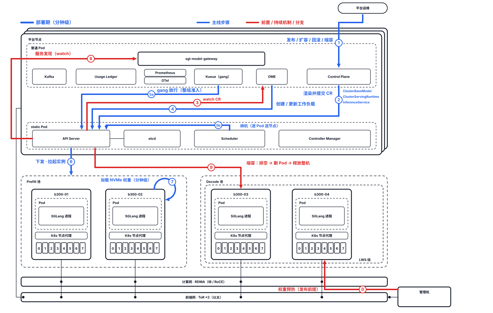
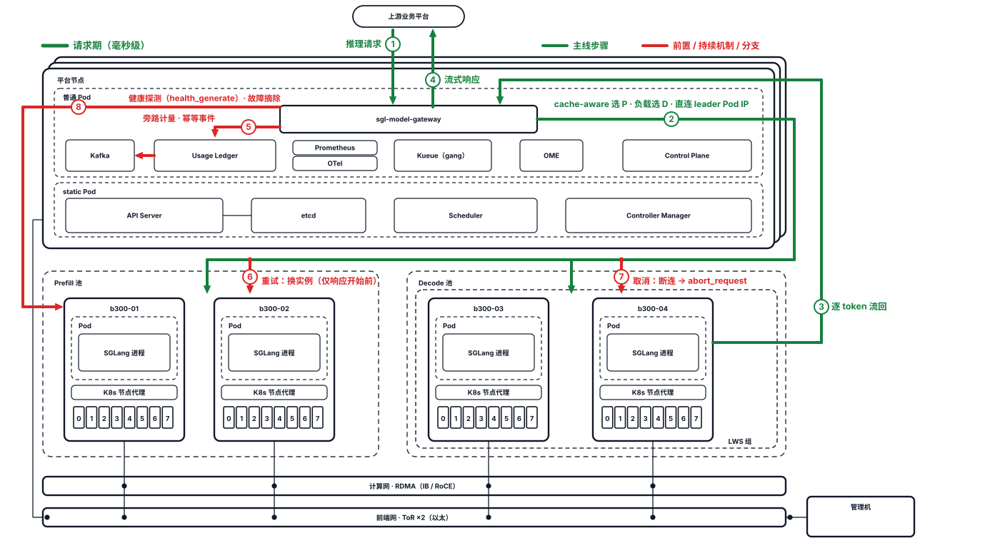

# AlayaJet-MaaS 系统设计（主文档）

> **文档性质**：平台架构的事实源，**完整但简略**——读完本文即可掌握全部设计决策与设计红线，
> 无需翻阅其他文档；分册只承载实现细节、字段全表与操作步骤。
> **组织方式**：全文围绕两张图展开——总架构图给出组件与部署结构，数据模型图给出数据与关系，
> 两张图都收在 1.2 系统全景；第 2–5、7 章分别细化两张图的一个区域，第 6 章展开数据模型。
> 依据：`design_review_notes.md`（七块走查的过程记录，结论已并入本文）。
> 图：`diagrams/*.svg`，生成脚本在 `diagrams/src/`，改图改脚本后重新生成，勿手改 SVG。
> 起草日期：2026-08-18

---

## 1 总览

### 1.1 平台定位

#### 1.1.1 平台职责

前五项是一次请求从无到有的完整链条，后两项是让这条链长期成立的支撑。

1. **资源纳管**：硬件资源经 commissioning（审计验收）、admission（准入）入池成为可调度容量。详见第 3 章。
2. **模型生命周期**：负责模型登记、权重预热、配置固化、release 上线，以及运行期的扩缩、暂停、回滚与下线。详见第 4 章。
3. **请求路由**：对请求完成模型定位、cache-aware 选 P、负载选 D 送到正确实例，管控重试边界、取消与过载。详见第 5 章。
4. **执行承载**：提供推理执行环境—— GPU、RDMA、预热权重、HiCache 内存，并维持实例存活与故障重建。详见第 2 章、4.5、8.2。
5. **用量计量**：记录每次调用用量，以幂等事件投递给上游计费。详见第 7 章。
6. **可观测性与 SLO**：定义并采集在线 SLO 指标（TTFT 、TPOT、goodput 等）。详见 8.3。
7. **集群引导与救援**：集群自身的从零引导、版本升级与故障救援。详见 2.1、8.2。

#### 1.1.2 平台边界

1. **Inference API**（业务平台 → 平台）：OpenAI 兼容 `/v1/chat/completions`（流式 / 非流式）、
   `/v1/models`。
2. **Usage Events**（平台 → 上游计费）：幂等用量事件与修正事件，Kafka · at-least-once。
3. **Management API**（平台运维 → 平台）：模型登记、发布、暂停、扩缩、节点准入。
4. **权重交付**（模型方 → 平台）：已发布权重与内容摘要，经管理机登记入库。

#### 1.1.3 业务规格

| 维度 | 选项 |
|---|---|
| 模型 | Kimi K3、MiniMax M3、GLM-5.2、DeepSeek V4 |
| 上下文长度 | 512K–1M；SLO 按 <32K / 32–512K / 512K–1M 分桶 |
| 流量规模 | 并发会话数、峰值 QPS、日 token 量、峰谷模型待定 |
| 输出长度 | Agent 多轮偏短、长文档问答中等 待定|
| 负载形态 | Agent 多轮、长文档问答；离线批量 待定 |
| KV 复用 | 单实例内 |
| 时延与可用性目标 | TTFT / TPOT 目标值、可用性等级 待定|
| 高可用标准 | 故障自动重建、N+1 冗余、降级不阻断推理；数字待定 |
| 模态 | 文本；多模态 |
| 响应模式 | 流式 / 非流式 |
| 流量来源 | 单一上游业务平台 |

### 1.2 系统全景

#### 1.2.1 系统组成


（粗框 = 硬件；色底 = 软件进程，颜色区分来源；虚线 = 逻辑概念；细线 = 物理网线，● = 接入该网）

架构分五个部分：

1. **物理基座**：B300 GPU 机 ×N、平台节点 ×3、管理机 ×1（集群外）；前端网与 RDMA 计算网
   物理隔离。详见第 2 章。
2. **推理执行**：每模型一对 prefill / decode 池；实例 = LWS 组（1–2 台整机），Pod 独占本机
   8 卡运行 SGLang 进程；KV 经计算网由 P 到 D。详见第 3、5 章。
3. **请求接入**：sgl-model-gateway 是请求路径上唯一的平台组件——按模型选池、cache-aware 配对
   P×D、直连实例 leader Pod IP。详见第 5 章。
4. **控制面**：Control Plane 把发布渲染成 OME CR，OME 与 K8s 控制面（Kueue gang 调度）把 CR
   收敛成运行实例。详见第 4 章。
5. **计量与观测**：Usage Ledger 旁路消费 gateway 日志与引擎 usage，产幂等事件入 Kafka；
   Prometheus / OTel 采集指标。详见第 7 章。

#### 1.2.2 运行方式

静态结构沿两条线动起来：**发布线**——Control Plane 写 CR，OME 拉起实例，权重已在节点本地，
分钟级 ready；**请求线**——gateway 配对转发，引擎执行、KV 过计算网，逐 token 返回。

| 时期 | 时间尺度 | 负责组件 | 职责 |
|---|---|---|---|
| 部署期 | 分钟级 | OME | 按 CR 声明创建 engine / decoder / router 三类工作负载，维持副本数，接线服务发现 |
| 请求期 | 毫秒级 | sgl-model-gateway | 按 model 选池、cache-aware 选 P、负载选 D、完成配对与转发；重试、熔断、限流、排队 |
| 执行期 | 每 token | 推理引擎（当前 SGLang + Mooncake TE / NIXL） | prefill 计算、KV 经 RDMA 传输、逐 token 生成 |

这三层的边界就是自研边界（1.2.4）：部署期与请求期只写声明与配置；执行期委托引擎——当前为
SGLang，属可替换组件（第 9 章）。

**部署期**（蓝 = 主线，红 = 前置 / 持续机制 / 分支）：



⓪ 权重预热（发布前提）→ ① 变更请求（发布 / 扩容 / 回滚 / 缩容，校验后受理）→ ② 渲染并提交
CR → ③ OME watch CR → ④ 创建 / 更新工作负载（LWS / Deployment）→ ⑤a Kueue gang 放行 ·
⑤b Scheduler 绑机 → ⑥ 下发拉起 → ⑦ 加载 NVMe 权重（分钟级）→ ⑧ 服务发现（watch · 探测后
加入）。⑨ 缩容分支：排空 → 删 Pod → 释放整机，权重副本保留。热暂停只改 `desired_state`
（摘除路由，不动工作负载）。

**请求期**：



① 推理请求 → ② cache-aware 选 P · 负载选 D · 直连 leader Pod IP → ③ 逐 token 流回 →
④ 流式响应。⑤ 旁路计量：gateway 日志与 usage → Usage Ledger → Kafka，投递上游为异步。
⑥ 重试：换实例重投，仅响应开始前。⑦ 取消：断连沿直连传播，引擎 `abort_request`。
⑧ 健康探测（health_generate）· 故障摘除：能生成 token 才算可用，覆盖 LWS 整组。

#### 1.2.3 数据视角


| 图上区域 | 数据链 | 可变性 | 详见 |
|---|---|---|---|
| 模型控制（橙，上两排） | 模型资产 → 配置记录 → 发布记录 → 模型服务 → 池 → 实例 | 只增不改，回滚是指针移动 | 第 4 章 |
| 资源管理（蓝，第三排） | 权重来源、节点权重副本、Node、GPU、Pod | 由系统收敛，不可人为改写 | 第 3 章 |
| 服务请求（绿，右列） | 请求 → 执行尝试 → 用量记录 → 用量事件 | 只增不改，更正以修正事件追加 | 第 5、7 章 |

每个实体的职责与数据不变量见第 6 章。

#### 1.2.4 自研边界

第一期自研只有两个进程，其余是上游固版组件加我们的配置资产：

1. **自研进程**：Control Plane（模型生命周期 + Management API + 渲染 OME CR）、
   Usage Ledger（用量计量）。
2. **上游固版**：sgl-model-gateway、SGLang 引擎、OME、LWS · Kueue、K8s · DRA、
   Kafka / Prometheus 等通用件，按镜像 tag / chart 版本固定（2.4）。
3. **配置与资产**：OME CR 模板、调度与节点配置、引导运维脚本、可观测资产、评测压测。

### 1.3 设计红线

十条禁令式规则，约束本文之后的每一次设计与评审；违反即缺陷，确需突破必须先重开本章：

1. **平台抽象止于实例**：任何平台组件不得以 Pod 为操作或可见粒度，Pod 只属于 K8s 内部（3.4）。
2. **请求路径不得引入破坏 cache 亲和的中间层**：K8s Service、round-robin LB 及任何无视实例
   亲和的转发一律禁止（3.4、5.4）。
3. **P/D 必须 KV 兼容**：同一服务的 P 池与 D 池严格同 revision、tokenizer、精度；允许两者
   漂移的设计不得引入（4.3）。
4. **配置链不可变**：模型资产、配置记录、发布记录一经创建不得原地修改；一切变更 = 新记录，
   回滚 = 指针移动（4.4、6.3）。
5. **用量事实唯一且不可篡改**：一次逻辑请求恰好一条权威用量记录，内部重试只归并；更正只能以
   修正事件追加（6.3、7.1）。
6. **计量不得阻断推理**：计量与投递组件的任何故障下推理必须继续；不得引入推理对计量的运行时
   依赖（7.3）。
7. **控制面不得进入请求路径**：OME、Control Plane 及任何新增控制面功能不得成为实例处理请求的
   运行时依赖（8.1）。
8. **引擎依赖必须走显式契约**：平台组件只依赖引擎的对外契约（OpenAI 协议、usage 透出、部署
   角色形态），不得耦合 SGLang 内部行为——为基于 SGLang 扩展或自研引擎保留替换空间（第 9 章）。
9. **测试形态不得固化进接口**：单 Pod、单池、K3s、单网等测试期形态不得写进任何抽象或 API
   （2.4）。
10. **租户语义不进平台**：`tenant_ref` 只透传、不解释，平台内部不得出现按租户判定的逻辑
    （1.1.2、7.2）。

阶段性决策不列入红线——Pod 独占整机、1 实例 = 1 LWS 组、预热先于发布、不改 SGLang 与 gateway
代码（第一期）各有放松条件，见第 3、4 章与第 9 章演进项。

---

## 2 硬件与网络基座

> 对应总架构图：底部的机器、两条网络条与管理机。

### 2.1 三类机器

| 类型 | 数量 | 角色 | 关键约束 |
|---|---|---|---|
| B300 GPU 机 | N ⚠ 待采购 | 承载推理实例，被实例整机独占 | GPU 池 taint 隔离，只跑引擎 Pod |
| 平台节点 | 3 | K8s 控制面 + 全部平台服务 | 无 GPU 的通用服务器；三台对等，组件各自选主 |
| 管理机 | 1 | 集群引导与救援入口；第一期的权重权威存放点与预热源 | **在 K8s 集群之外**，不装 kubelet、不被调度 |

平台节点上三台机器如何各自保证可用性：etcd 靠 raft（容忍 1 台）、Scheduler 与 Controller
Manager 靠 leader-election、gateway 多副本、router 单 active + 快速接管。

**平台服务不跑在 B300 上**的四个理由：HiCache 使主机内存带宽成为推理性能的一部分，平台服务会与
之争抢；GPU 池 taint 机制本就禁止；控制面的故障域不应绑在故障最频繁的 GPU 机上；成本。

命名纪律：平台节点不叫"CPU 节点"，避免与 B300 机内的 CPU（服务本机推理：节点代理、SGLang
host 侧、HiCache 内存层）混淆。对象存储到位后（演进项），管理机退化为纯运维跳板。

### 2.2 单机规格

| 项 | 取值 | 状态 |
|---|---|---|
| GPU | 8 × B300，HBM3e 288 GB/卡，单机 ≈ 2.3 TB | 基线 |
| 机内互联 | NVLink 5 全互联（同机 8 卡为一个 NVLink 域） | 基线 |
| 计算网网卡 | ConnectX-8 800G × 8，rail-aligned（每卡一张） | ⚠ 数量与型号待采购确认 |
| 主机内存 | DDR5，上限 4 TB | ⚠ 容量按 HiCache 需求定（2.5） |
| 本地盘 | NVMe ≈ 30 TB | ⚠ 容量按权重缓存需求定（2.5） |

单机 8 卡是一个 NVLink 域，也是平台的最小独占单位——这是"Pod 独占整机、卡数恒 8 的倍数"这条
策略的物理来源。K3 能否在单机 8 卡内跑起 FP8 全量权重，决定它的实例规格是 size = 1 还是
size = 2，属待压测项。

### 2.3 双物理网

两张物理隔离的网络，承担完全不同的流量：

| 网络 | 载体 | 承载 | 失效后果 |
|---|---|---|---|
| 前端网 | 以太，ToR × 2，走 CNI | 推理请求与响应、K8s 控制流量、管理流量、监控 | 请求进不来 |
| 计算网 | RDMA（IB 或 RoCE ⚠ 待定），GPUDirect | PD 之间的 KV 传输、多机实例内的 TP / EP 通信 | 跨机 KV 断，多机实例与 PD 配对失效 |

配套要求：Network Operator + RDMA device-plugin 下发；节点审核清单扩展 RDMA 网卡数量 / 型号 /
带宽 / GPU-网卡 PCIe 亲和、NVMe 容量与健康；计算网带宽进容量规划。KV 传输在图上表现为
"P 池 →（KV 出）→ 计算网条 →（KV 入）→ D 池"两段，网络条就是介质，不画池到池的凭空直连。

### 2.4 软件版本基线

生产集群：**K8s 1.34.2（DRA GA）+ NVIDIA DRA Driver 0.4.1 + GPU Operator 26.3.3**。
测试集群 s04 / s05 / s07 用 K3s，仅为测试期实现，其形态（单 Pod、单池、单网）不得固化进任何
接口。

与之并列的第二条基线：**sgl-model-gateway 与 SGLang 引擎的版本兼容矩阵**——两者物理同仓、协议
耦合，升级必须成对验证。

### 2.5 给采购的需求参数

设计承担给采购提需求的职责，四项：

1. **RDMA 计算网**：每节点网卡数与带宽、集群对分带宽、IB vs RoCE 取舍。
   估算式：`带宽需求 ≈ 单请求 KV 体积 × prefill 完成速率 × 并发系数`；单请求 KV 体积 =
   上下文长度 × 每 token KV 字节数，以 1M 上下文算上界，再按 P:D 配比折到每机。
2. **GPU 节点主机内存**：HiCache 的 CPU 内存层容量。
   估算式：`每实例 HiCache 内存 ≈ 期望驻留的历史 KV 总量`（并发会话数 × 平均上下文长度）；
   该值同时是 Pod 的 memory request。
3. **节点 NVMe**：权重缓存（每模型一份完整权重 × 该节点可能承载的模型数）+ 可能的 KV 第三层。
4. **对象存储**：⚠ 第一期不采购（4.7），列为演进项。

起点值压测后回填；本节的公式与量纲是采购谈判的依据。

---

## 3 资源模型与调度

> 对应总架构图：Prefill / Decode 池、机器内的嵌套（节点代理 ⊃ Pod ⊃ SGLang 进程 ＋ 8 卡）、
> 平台节点上的 Kueue 与 K8s 控制面。对应数据模型图：资源管理那一排。

### 3.1 一台机器如何进入系统

1. **上架与联网**：接入前端网与计算网（2.3）。
2. **加入集群**：装 kubelet / containerd，成为 K8s Node。
3. **硬件审核**：按审核清单核对 GPU 逐卡 UUID、RDMA 网卡数量与带宽、GPU-网卡 PCIe 亲和、
   NVMe 容量与健康；逐卡 UUID 审计用于到货验收与坏卡定位。
4. **准入**：由运维经 `node_manager` 显式准入（不准入的机器不参与任何调度）。
5. **打标签入池**：`instance_class`（机型规格类别）与 `serving_pool`（可服务的池），加 GPU 池
   taint；此时它成为候选机器。
6. **权重预热**：把该池会承载的模型权重推到本机 NVMe，`节点权重副本 = ready`（4.7）。

只有走完 6 步的机器才可能承载实例。第 4 步与第 6 步是我们自己的脚本，第 2、5 步是 K8s 原生。

### 3.2 GPU 与 DRA

GPU 通过 DRA 被发现，每张卡有 uuid、product_name、显存与运维别名（别名用于把审核记录与运行态
关联）。生产池的策略是整机独占：

- Pod 通过一次 DRA claim 申请本机 **8 卡**（`count: 8`），因此一台机器在同一时刻只承载一个
  引擎 Pod；
- 配置记录的卡数校验恒为 **8 的倍数**；
- GPU 池 taint 隔离，只有引擎 Pod 能落入。

Pod 与 GPU 是直接的按设备分配关系（受"必须同机"约束）；Pod 与 Node 之间那条"绑定"边在信息上
是冗余的，其"独占整机"的一半是我们的策略而非 K8s 的必然。混装与细粒度装箱能力保留，但降级为
测试池与未来小模型池的能力，第一期验收只聚焦**整机 claim 的分配与回收正确性**。

### 3.3 实例、成组与原子性

**1 实例 = 1 LWS 组**，`size` = 机器数，单机实例是 size = 1 的退化情形。两种机制分工明确：

- **LWS** 是持久的成组声明，其 controller 在**创建、故障、升级**三个时刻强制"成组"（任一成员
  故障则整组重建）；
- **gang（Kueue）** 只负责**调度时刻的原子性**：要么组内全部 Pod 同时放行，要么都不放行，避免
  半个实例占着卡等另一半。

OME 每池创建一个管理者对象（Deployment 或 LWS），扩容改 replicas，**不是每实例一个对象**。

### 3.4 粒度一致性：平台抽象止于实例

| 组件 | 粒度 | 说明 |
|---|---|---|
| OME | 实例 | 只声明"要几个实例"，不挑具体 Pod |
| sgl-model-gateway | 实例 | 以实例为单位选点，寻址直连 **leader Pod IP**；worker Pod 不接请求，只参与 TP / EP 通信 |
| Control Plane / Management API | 实例 | 只报期望与健康实例数，不暴露 Pod 与内部 endpoint |
| K8s Scheduler | Pod | 真正把 Pod 绑到 Node，但对"这些 Pod 属于同一实例"无感知 |

两条硬性推论：readiness 聚合为"实例 ready = 组内全员 ready"；**K8s Service 不得进入请求路径**
—— kube-proxy 的 round-robin 会摧毁前缀缓存亲和（红线 2）。单机实例是否也统一用 LWS 属
待实测项（OME 默认可能对单机用 Deployment）。

### 3.5 节点代理

一台 GPU 机上的节点侧组件分四格：**kubelet**（唯一指挥者）→ **containerd**（起容器）/
**DRA**（注入 GPU）/ **CNI · RDMA**（配网），后三者作用于 Pod。kubelet 与 containerd 是装机
系统服务；DRA 与 RDMA 插件由 GPU Operator / Network Operator 以 DaemonSet 下发。

### 3.6 调度候选集与容量口径

某模型某角色的**调度候选集** = 打了对应 `serving_pool` 标签的已准入节点 ∩ 该模型 revision 的
权重副本已 ready 的节点 ∩ 当前没有实例占用的节点。故障重建落在同一候选集内。

**容量口径**：池容量（实例数）= 可用机器数 ÷ 实例 size。因此双机实例的池，容量以 2 台为一档
增减；单机故障使容量下降一整档（第 8 章）。P:D 配比是容量规划参数，建议按卡数 1:1 起测、向
prefill 微调（待压测）。

---

## 4 模型服务与发布

> 对应总架构图：Control Plane →写 CR→ OME →写对象→ API Server 这条链，以及管理机的权重预热。
> 对应数据模型图：模型控制那一排（模型资产 → 配置记录 → 发布记录 → 模型服务 → 池 → 实例）。

### 4.1 从权重到服务的链条

```text
权重来源（管理机）→ 模型资产 → 配置记录 → 发布记录 → 模型服务
                                              ↓（OME 部署期）
                                    prefill 池 / decode 池 → 实例 → Pod
```

前四段由 Control Plane 持有、只增不改；后三段是 OME 与 K8s 的运行态，由系统收敛。

### 4.2 模型资产与权重预热

1. 运维在管理机上从模型官方发布或 HF 仓库下载权重，计算内容摘要；
2. 向 Control Plane **登记模型资产**：`model_id` + 不可变 `revision` + 权重地址 + 内容摘要 +
   登记人与时间；
3. Control Plane / 脚本把权重推到候选节点池（**含冗余台**）的 NVMe，形成**节点权重副本**；
   OME 的 `downloadPolicy: ReuseIfExists` 保证"本地已有则跳过"；
4. 副本 ready 后，该节点才进入这个模型的调度候选集（3.6）。

`revision` 不可变是整条链的地基：同一个 `model_id` 的新权重必须是新 revision，不允许原地覆盖。

### 4.3 配置记录（Profile）

**单份配置记录 = 公共模型段 + prefill 段 + decode 段**。之所以不是两份：P/D 两池的模型
revision、tokenizer、精度必须严格一致（红线 3），单份结构让这条红线在构造上成立——一个
revision 就是一份完整自洽、可部署的配置。

配置记录显式声明的关键项：模型与 tokenizer 与精度（公共段）；每角色的并行度与卡数（恒 8 的
倍数）、实例 size；**HiCache 的主机内存**（决定 Pod 的 memory request）；1M 级 `max_context`；
PD 相关参数；固化的别名版本。

配置记录本身也带 `revision` 且不可改——改配置 = 产生新的配置记录 revision。

### 4.4 发布与生效

发布请求形态：`service_id + profile_ref + prefill_instances + decode_instances`。发布过程：

1. Control Plane 校验：配置记录存在、卡数为 8 的倍数、目标 revision 的权重副本在足够多的候选
   节点上 ready（不满足则拒绝发布，而不是先发布再等权重）；
2. 生成**发布记录**（不可变，记录 profile_ref、两个实例数、创建人与时间）；
3. 把配置记录渲染为三种 OME CR：`ClusterBaseModel`（模型身份与权重位置）、
   `ClusterServingRuntime`（引擎运行时形态）、`InferenceService`（服务与各角色副本数）；
   **Control Plane 只写 CR，绝不直接创建工作负载**；
4. OME 在部署期创建 / 更新工作负载，Kueue 保证成组放行，实例逐个 ready；
5. 模型服务的 `current_release` 指向这条发布记录，服务对外可用。

**字段映射（勿写错）**：

| 我们的说法 | OME 字段 |
|---|---|
| prefill 池 / P 池 | `engine` |
| decode 池 / D 池 | `decoder` |
| 路由 | `router` |
| prefill_instances / decode_instances | `engine.minReplicas` / `decoder.minReplicas` |
| desired_state | 挂在 `InferenceService` 上 |

### 4.5 状态：只存一个字段

不新增任何存储的运行状态。唯一存储的是 `desired_state: running / suspended / paused`（挂在
`InferenceService` 上）；对外呈现的 `pending / ready / degraded / unavailable` 都是查询时从
K8s 事实**现算**的派生标签；`draining` 是排空操作的过程标记。

聚合规则：

- 实例 ready = LWS 组全员 ready；
- 池 ready 实例数 = 该池 ready 的实例个数；
- 服务 ready = 各角色池均 ≥ 1 实例 ready（PD 下是**与**条件：P 池空则出不了首 token，D 池空则
  出不了词）；
- 服务 degraded = 有 ready 实例但少于期望数。

这样做的理由：任何自存的运行状态都会与 K8s 事实漂移，而 K8s 本身已经是权威事实源。

### 4.6 变更操作

| 操作 | 语义 | 实现 |
|---|---|---|
| 扩缩 | 改某角色的实例数 | 改 `minReplicas`，OME 收敛；新实例只能落在已预热节点 |
| 热暂停（suspended，**默认档**） | 只关路由，实例保温、权重留在显存 | 改 `desired_state`；gateway 停止向该服务选点 |
| 冷暂停（paused） | 显式释放资源：排空后删工作负载、释放 GPU、保留配置 | 改 `desired_state` + 排空 |
| 回滚 | 回到上一个发布 | `current_release` 指回旧发布记录，OME 收敛回旧 CR |
| 下线 | 停服务、保留历史 | 冷暂停后删除模型服务的对外身份；发布记录与用量记录永久保留 |
| 取消单请求 | 精确终止一次调用 | gateway 维护 `request_id → engine rid`，经 `abort_request` 取消；**永不以杀 Pod 的方式取消请求** |

暂停默认走热暂停的原因：**不能轻易卸载权重**——K3 级权重重载是分钟到十分钟级，冷暂停必须是
运维显式选择的"我要释放这些卡"。

### 4.7 权重分发与 N+1 的真实含义

第一期**没有对象存储**（已拍板）。权重路径：管理机（权威存放点）→ 脚本推到节点 NVMe
（`local://` + `ReuseIfExists`）→ 引擎启动时加载进显存。

被否决的方案是首次调度时按需拉取：K3 级 1.5T 权重现拉会把启动从分钟级拖到几十分钟甚至小时级，
故障恢复时间不可接受。

由此，**N+1 冗余的准确含义是 N+1 台已预热好权重的机器**，不是 N+1 台空闲机器；备用节点的
NVMe 要提前放权重，这条进容量规划。"预热节点池耗尽"因此是一个独立的故障模式（8.1）。

演进：对象存储 + P2P（Dragonfly）上线后按需拉取才可行，届时预热要求可放松。

---

## 5 PD 分离与请求路径

> 对应总架构图：上游 → gateway → 两个池 → 计算网的 KV 出 / KV 入。
> 对应数据模型图：服务请求那一列（请求 → 执行尝试）与池 / 实例。

### 5.1 PD 分离是什么、不是什么

**是**：Prefill 实例与 Decode 实例各自是完整的模型副本（各持全量权重、各有 TP 组），中间通过
RDMA 传 KV。**不是**：把一个模型切成两半分别放在不同的卡上。

"单机内 1 卡 prefill + 7 卡 decode"这种打包形态对目标模型清单不成立：K3 单机放两份副本需
约 3 TB > 2.3 TB HBM；M3 / GLM 勉强放下，但会吃掉 1M 上下文最需要的 KV 空间。

平台也**不引入 P-D 静态打包单元**这层抽象：静态打包省不掉 RDMA 计算网（跨机照样传 KV）、省不掉
软件（动态配对是 gateway 原生能力），却要多付两笔代价——故障耦合（P 机挂拖死整个单元）与
prefill 无法池化（长文档洪峰下利用率差）。

**PD 对平台抽象的全部侵入面只有两处**：配置记录的 role 段、发布记录的两个实例数。因此 PD 分离
是架构决策 + 配置工程，**第一期自研量为 0**（SGLang-native 全栈前提）。降级口：若压测发现小规模（如 1P + 1D）动态配对不稳，可
在 gateway 配置层退化为固定配对，不动平台抽象。

### 5.2 池的划分

池 = **模型 × 角色**。当前 4 个模型 × 2 个角色 = 8 个池。这些池的机器都来自同一个共享 GPU 节点池，
一台机器在同一时刻只承载一个实例；池不是物理分区，而是标签 + 实例归属形成的逻辑集合。

### 5.3 一次请求的完整路径

1. 上游访问一个稳定的入口地址（零逻辑的哑 VIP / L4 LB，为将来换入口留接缝）；
2. **sgl-model-gateway** 收到 `/v1/chat/completions`，按 `model` 字段定位到对应的模型服务与
   它的 P / D 两个池；
3. 在 P 池内按 **cache-aware** 策略选 prefill 实例（前缀命中优先），在 D 池内按负载选 decode
   实例，完成 P×D 配对；
4. 直连所选实例的 **leader Pod IP** 转发（不经过 K8s Service，3.4）；
5. prefill 实例计算首 token 所需的全部 KV（**执行期**）；
6. KV 经 **RDMA 计算网**（Mooncake TE / NIXL）传到 decode 实例；
7. decode 实例逐 token 生成，经 gateway 流式或整体返回上游；
8. gateway 输出结构化日志与 usage，**Usage Ledger 旁路**消费，产出用量事件（第 7 章）。

三个时期在这条路径上的落点：步骤 2–4 是请求期，步骤 5–7 是执行期，而使这些实例存在的是部署期。

### 5.4 选点策略与寻址

选点逻辑**全部在 gateway 内部**，我们不写选点代码，只做两件事：把它配置对，把它的行为纳入实测
清单。三条硬约束：

- **实例级亲和不可破坏**：请求路径上不允许任何 round-robin（Service、通用 LB 的轮询都不行），
  否则前缀缓存命中率会塌；
- **寻址到 leader Pod IP**：多机实例只有 leader 接请求，worker 只参与 TP / EP 通信；
- **不感知 PD 内部**：Control Plane 与 K8s 都不参与配对，配对是 gateway 的请求期行为。

待实测项：gateway 决策的可解释性（日志是否足以复盘选点）、多副本时 cache-aware 视图分裂问题。

### 5.5 重试、取消与过载

- **重试边界**：只在响应开始前重试，换实例、保持同一 `request_id`；响应已开始则不重试（流式已
  吐字后不能重来）。同一逻辑请求的多次尝试在计量上归并为一条用量记录（红线 5）。
- **取消**：断连传播 + 引擎自身的断连中止覆盖大部分场景，另有显式取消路径（4.6）。
- **过载**：第一期**不做 token 预算准入**（已拍板）。代价显式记录：过载表现为排队与 TTFT 劣化，
  而不是入口快速失败。第一期自保护 = gateway 内建限流 / 排队 / 熔断 + 引擎本地队列；租户配额在
  上游。重启准入的触发条件见第 9 章。
- **入口副本**：gateway 单 active + 快速接管起步。"全平台入口压在单 active 进程"的可用性与多
  模型 radix 状态规模是待实测项；撑不住则退回每模型一组 + 薄入口。

### 5.6 流式与非流式

同一接口的两种响应模式：非流式一次性返回完整 body，`usage` 在 body 内且精确；流式按 SSE 逐块
推送，`finish_reason` 与用量在末尾事件给出。**流式中断也必须产出用量事件**
（`finish_reason=abort`）。两种模式在计量上都要区分 **generated**（引擎已生成）与
**delivered**（实际送达上游）——差异只在流式中断时才出现。

### 5.7 长上下文与 KV 分层

单实例内 HiCache 分层：HBM → 主机内存 →（必要时）NVMe；**不引入外部 KV 池**。引擎能力留给平台
的账单有三笔：配置记录要声明 HiCache 主机内存（4.3）；GPU 节点的 CPU 内存容量成为采购需求项
（2.5）；并发容量 = f(HBM 余量 + HiCache 内存层)，进容量规划。

---

## 6 数据模型


### 6.1 三类数据与它们的可变性

- **模型控制**（模型资产 → 配置记录 → 发布记录 → 模型服务，以及发布出的池与实例）：只增不改，
  由 Control Plane 持有；
- **资源管理**（权重来源、节点权重副本、Node、GPU、Pod）：由系统收敛，不可人为改写；
- **服务请求**（请求 → 执行尝试 → 用量记录 → 用量事件）：只增不改，用量事实不可篡改，只能以
  修正事件追加。

### 6.2 实体职责

| 实体 | 持有方 | 唯一权威的事实 |
|---|---|---|
| 权重来源 | 管理机 | 权重从哪来、内容摘要是多少 |
| 模型资产 | Control Plane | 一个 `model_id` + 不可变 `revision` 的身份与权重地址 |
| 配置记录 | Control Plane | 一份自洽可部署的配置（公共段 + P/D 双段） |
| 发布记录 | Control Plane | 某次发布用了哪份配置、各角色几个实例、谁在何时发布 |
| 模型服务 | Control Plane | 对外服务身份、`current_release`、`desired_state` |
| 节点权重副本 | OME | 某节点上某 revision 的权重是否 ready |
| Node | K8s | 机器的准入状态、`instance_class`、`serving_pool` |
| GPU | DRA | 卡的 uuid、型号显存、运维别名 |
| Pod | K8s | 容器组的 endpoint 与整机 8 卡 claim |
| prefill / decode 池 | OME | 某模型某角色的实例集合 |
| 实例 | K8s（LWS 组） | 一个可被选点的服务单位，`size` = 机器数 |
| 请求 | Gateway | 一次上游调用（`request_id`、`tenant_ref` 透传、目标 `service_id`） |
| 执行尝试 | Gateway | 该请求的第 n 次尝试落在哪个实例、结果如何 |
| 用量记录 | Usage Ledger | 一次逻辑请求的权威用量（与请求 1:1） |
| 用量事件 | Kafka | 投递给上游的幂等事件（`event_id`、`correction_of`） |

### 6.3 三条数据不变量

1. **不可变链**：模型 revision → 配置记录 revision → 发布记录，任一环都不原地改写；回滚是指针
   移动，不是数据修改。
2. **一次逻辑请求 1:1 一条用量记录**：内部重试只增加执行尝试记录。
3. **投递幂等**：`event_id` 是幂等键，修正通过 `correction_of` 追加成链，消费方按 `event_id`
   去重，因此重放安全。

---

## 7 用量与计量

> 对应总架构图：gateway →（日志 · usage）→ Usage Ledger → Kafka → 上游计费。

### 7.1 事件如何产生

Usage Ledger 是**旁路**组件，不在请求路径上（因此不影响推理可用性）：

1. 消费 gateway 的结构化日志 / OTel 与引擎透出的 usage；
2. 按 `request_id` 把内部重试**归并**成一条逻辑请求；
3. 产出幂等事件（`event_id` 为幂等键）写入账本，账本可重放；
4. 投递到 Kafka（at-least-once），消费方按 `event_id` 去重；
5. 需要更正时追加修正事件，`correction_of` 指向被修正的事件，形成修正链。

### 7.2 计量字段与口径

必备字段：`request_id`、`input` 与 `cached_input_tokens`、`generated`、`delivered`、
`finish_reason`、`tenant_ref`（透传，不解释）、`region` / `cluster`（多机房接缝，当前为常量）、
TTFT / TPOT 观测字段。

**双记录**：generated 与 delivered 都记，计价口径留给上游选。平台主推 **generated**——旁路方案
拿不到精确的 delivered；上游若坚持按 delivered 计费，需重开入口层讨论，这是明确的契约谈判位。

### 7.3 降级与契约两栏制

降级取舍：**计量可用性 < 推理可用性**。Kafka 或 Ledger 故障时本地缓冲落盘补发，绝不阻断推理；
流式中断必须产出事件（`finish_reason=abort`）。

上游契约未定期间采用两栏制：

- **单方面冻结栏**（我们自己就能定，且承诺不变）：事件 schema、幂等语义、correction 语义、
  `tenant_ref` 透传、推理不因计量阻断、错误码集合；
- **谈判位栏**（需与上游确认）：传输通道（Kafka 为默认，上游不接则加薄推送适配器、不动账本）、
  计价口径、租户标识格式与签名、对账周期、过载语义承诺（与"第一期不做准入"直接挂钩）。

---

## 8 可靠性与故障

### 8.1 故障域与爆炸半径

| 故障域 | 影响 | 恢复 |
|---|---|---|
| 单卡 | 整机引擎进程组崩溃 → 该实例失效（无卡级冗余） | 实例重建 |
| 单机（Node = Pod） | 该实例失效，**且该机的权重副本一并失效** | 在已预热的候选节点上重建；机器修复后需重新预热 |
| 实例（LWS 组） | 池容量下降一整档；在飞请求失败，由 gateway 重投 | 整组重建（多机实例任一成员故障即整组） |
| prefill 池全失效 | 该模型出不了首 token | 依赖预热节点池补充实例 |
| decode 池全失效 | 该模型出不了词 | 同上 |
| 计算网（rail / leaf） | 跨机 KV 传输中断 → PD 配对与多机实例失效 | 网络恢复；⚠ 单 leaf 的影响范围取决于机架与 leaf 划分（待采购确定） |
| 前端网 | 请求进不来 | 双 ToR 冗余 |
| 平台节点单台 | K8s 控制面降级（etcd 容 1 台），gateway 多副本存活 | 机器恢复或替换 |
| 控制面（OME / Control Plane） | **只影响变更**（发布、扩缩、重建），存量推理不受影响 | 组件重启 |
| 计量（Kafka / Ledger） | 账单滞后，推理不受影响 | 缓冲补发、账本重放 |
| 管理机 | 只影响集群引导救援与权重预热 | 重建（无状态化后可快速重建） |
| **预热节点池耗尽** | 有故障但没有可承载的已预热机器 → 容量无法恢复 | 扩充预热节点（这是 N+1 的真实约束） |

### 8.2 冗余与恢复

- **N+1 = N+1 台已预热权重的机器**（4.7），不是 N+1 台空闲机器；
- MTTR 十分钟级的目标在"权重已在本地 NVMe"这个前提下才成立；
- 多机实例整组重启，冗余以**整机**为单位准备；
- suspended 服务的实例故障照常自动重建，但告警降为工单（`desired_state` 是判定依据）；
- Prefill 过载表现为排队与 TTFT 劣化，这是不做准入的已知代价（5.5）。

### 8.3 SLO 与观测

在线 SLO 第一天就建、数字压测后定：TTFT 按输入长度分桶（< 32K / 32–512K / 512K–1M 起步，
后续按业务分布修正）、TPOT / ITL、goodput、前缀命中率、P/D 水位、KV 传输带宽。与离线评测框架
共用指标口径（`evaluation/framework.md`）。

### 8.4 待补两项

1. **按等级分的完整故障表**：故障模式 / 等级 / 爆炸半径占容量比例 / 探测方式 / 恢复动作与时长 /
   冗余是否覆盖；
2. **放置约束**：哪些实例的机器不得共享机架、leaf 交换机与供电域——依赖机架数、每机架台数、
   leaf 划分与起始机器数这几个采购参数（2.5）。

故障演练在 `planning` M4，结果回填本章。

---

## 9 演进项

均带触发条件，未触发则不做：

| 演进项 | 触发条件 |
|---|---|
| 多机房 | 出现第二个机房；当前只留三条接缝（显式转发、部署参数化、`region` 字段），不做全局调度器、不做跨机房 PD |
| token 预算准入 | 上游流量不可控 / 多上游接入，或压测出现少量巨请求拖垮全池，或需对上游承诺 429 + Retry-After 背压 |
| 对象存储 + P2P（Dragonfly） | 模型或节点规模使手工预热不可维护 |
| EPP 路线重启 | sgl-model-gateway 在可解释性、多副本或策略扩展上实测不达标 |
| 基于 SGLang 扩展 / 自研推理引擎 | 已在路线上，启动时机与形态 ⚠ 待定；平台侧前提：引擎依赖走显式契约（红线 8） |
| 通用网关层 | 多机房 / 按 delivered 计费 / 多上游入口治理 |
| 宽 EP（大规模专家并行） | 模型形态与流量规模需要 |
| 小模型池（含 embeddings / rerank） | 出现小模型业务需求 |
| 多模态推理 | 模型清单中出现视觉模型 |
| 服务分级实现 | 上游提出差异化 SLO |
| 外部 KV 池 | 跨实例 KV 复用成为瓶颈解 |
| Control Plane API 形态定型 | 运维交互设计 review 之后 |

---

## 附录 A 待定与待验证项

| 项 | 类型 | 说明 |
|---|---|---|
| 上游对接契约细节 | 待拍板 | 决定契约文档哪些字段可改（7.3 两栏制） |
| Control Plane / Usage Ledger 语言 | 待拍板 | Control Plane 要写 CR，Go 生态更省事 |
| Kafka 自建还是上游提供 | 待拍板 | 影响平台节点上的组件清单 |
| 引擎指标来源 | 待拍板 | SGLang 自带 Prometheus 端点是否够用，还是自写 exporter |
| Management API 形态 | 待拍板 | 运维交互设计需 review |
| 离线批量推理是否在范围 | 待确认 | 影响容量规划与调度策略（1.1.3） |
| 入口鉴权与内容安全的责任归属 | 待确认 | 见 1.1.2 第 5 条；若归平台则入口设计要改 |
| 采购参数：机器数 N、机架与 leaf 划分、IB vs RoCE、网卡数、主机内存、NVMe 容量 | 待采购 | 见 2.5；同时卡住 8.4 的放置约束 |
| gateway 结构化日志字段与 usage 透出 | 待实测 | Usage Ledger 计费级事件依赖；不满足则给上游提 patch |
| OME 的 PD 角色字段 + LWS 多机支持完整度 | 待实测 | 现有集群只验证过单机单池路径 |
| DRA driver 整机 claim 行为 | 待实测 | 与 K8s 版本基线绑定（2.4） |
| gateway 决策可解释性与多副本行为 | 待实测 | cache-aware 多副本视图分裂问题 |
| 单机实例是否也用 LWS | 待实测 | OME 默认可能对单机用 Deployment |
| P:D 起始配比 | 待压测 | 按卡数 1:1 起测，向 prefill 微调 |
| K3 FP8 单机 HBM 可行性 | 待压测 | 决定 K3 实例是 size = 1 还是 size = 2 |
| 多模型单 active 入口容量 | 待压测 | 撑不住则退回每模型一组 + 薄入口 |
